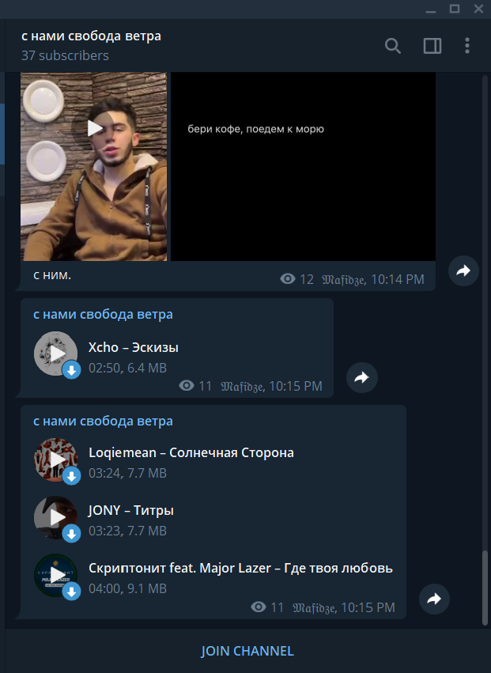
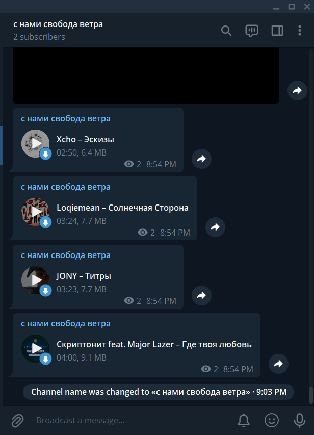
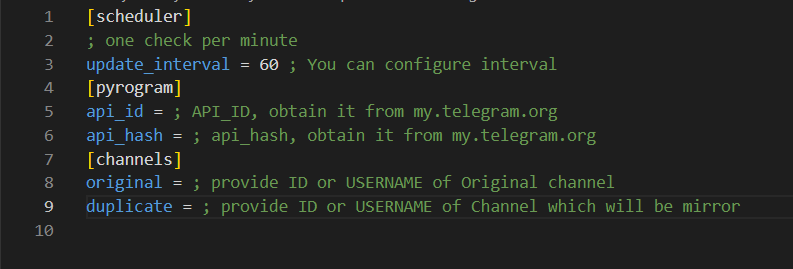

# MfReposter
## Create mirror of channel in Telegram!
### Example

#### Original channel


### Mirror


### How to run?

#### Firstly, install dependencies!
```
cd MfReposter/
pip install -r requirements.txt
```
### Also create a config file
```
touch config.ini
vim config.ini
```
### Example config
 <br>
```
[scheduler]
; one check per minute
update_interval = 60 ; You can configure interval
[pyrogram]
api_id = ; API_ID, obtain it from my.telegram.org
api_hash = ; api_hash, obtain it from my.telegram.org
[channels]
original = ; provide ID or USERNAME of Original channel
duplicate = ; provide ID or USERNAME of Channel which will be mirror

```

Copy & paste example to your config.ini and fill each field
You can get API_ID and API_HASH from <a href='https://my.telegram.org'>here</a>!

## Run
```
python main.py
```

With ❤, Awaitable
